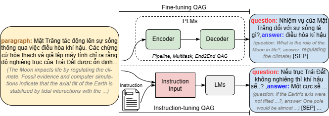
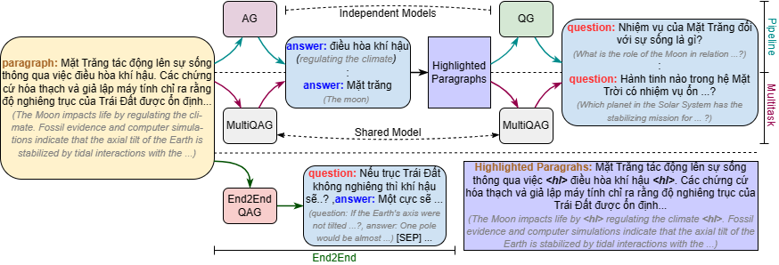
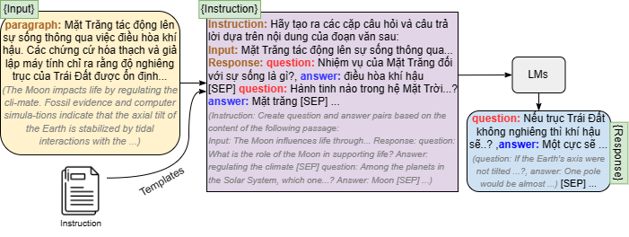

# Towards Vietnamese Question and Answer Generation: An Empirical Study [[paper](https://dl.acm.org/doi/abs/10.1145/3675781)]
Question-answer generation is formulated as a text-generation task by using PLMs and LLMs. Given a context paragraph $C = \{s_{1}, s_{2}, ..., s_{n}\}$ with $\textit{n}$ sentences, QAG models are required to generate natural QA pairs $\mathcal{Q}$ = $\{(q_{1}, a_{1}), (q_{2}, a_{2}), ...\}$. Formally, QAG can be written as a conditional generation process as $\mathcal{Q} = f(Q|C, \theta)$, where $Q$ is the gold QA pairs in the training dataset, $C$ is the context, $f()$ is an encoder-decoder or a generative language model, and $\theta$ is the parameter of the model. The parameter $\theta$ can be learned by using encoder-decoder PLMs or generative LLMs.

<figure>
  <p align="center">
    
  </p>
  <p align="center"><strong>Fig.1: The system overview of fine-tuning and instruction fine-tuning QAG.</strong></p>
</figure>

## Usage
### Install
```python
git clone https://github.com/Shaun-le/ViQAG.git
cd ViQAG
```
### Prerequisite
To install dependencies, run:
```python
pip install -r requirements.txt
```

## Question and Answer Generation
- **Generate QAG with Pipeline Models:** The pipeline model operates in two distinct stages for Question Answer Generation (QAG): answer extraction/generation (AE) and question generation (QG). In the initial phase, the model takes an input paragraph context $C$ and produces a corresponding answer $\bar{a}$ through extraction or generation. Subsequently, leveraging the obtained answer $\bar{a}$ along with the context $C$, the model generates the question $\bar{q}$. Since the Pipeline trains independent AE and QG models, they need to be handled separately. The models are referred to as ```model``` and ```model_ae```, representing QG and AE models, respectively.
```python
from plms.language_model import TransformersQG
model = TransformersQG(model='namngo/pipeline-vit5-viquad-qg', model_ae='namngo/pipeline-vit5-viquad-ae')

input = 'Lê Lợi sinh ra trong một gia đình hào trưởng tại Thanh Hóa, trưởng thành trong thời kỳ Nhà Minh đô hộ nước Việt.' \
        'Thời bấy giờ có nhiều cuộc khởi nghĩa của người Việt nổ ra chống lại quân Minh nhưng đều thất bại.' \
        'Năm 1418, Lê Lợi tổ chức cuộc khởi nghĩa Lam Sơn với lực lượng ban đầu chỉ khoảng vài nghìn người.' \
        'Thời gian đầu ông hoạt động ở vùng thượng du Thanh Hóa, quân Minh đã huy động lực lượng tới hàng vạn quân để đàn áp,' \
        'nhưng bằng chiến thuật trốn tránh hoặc sử dụng chiến thuật phục kích và hòa hoãn, nghĩa quân Lam Sơn đã dần lớn mạnh.'

qa = model.generate_qa(input)

print(qa)

[
  ('Quân Minh đã sử dụng chiến thuật nào để đánh quân vào vùng thượng du Thanh Hóa?','huy động lực lượng tới hàng vạn quân')
  ('Có bao nhiêu cuộc khởi nghĩa của người Việt chống lại quân Minh?', 'nhiều cuộc khởi nghĩa của người Việt nổ ra'),
  ('Lê Lợi đã làm gì vào năm 1418?', 'tổ chức cuộc khởi nghĩa Lam Sơn'),
]
```

- **Generate QAG with Multitask and End2End Models:** The Multiask models are trained to both generate answers and questions, which distinguishes them from End2End models capable of generating question-answer pairs simultaneously. Since both methods utilize a single model, only passing the ```model``` is sufficient.
```python
from plms.language_model import TransformersQG
model = TransformersQG(model='shnl/vit5-vinewsqa-qg-ae')

input = 'Lê Lợi sinh ra trong một gia đình hào trưởng tại Thanh Hóa, trưởng thành trong thời kỳ Nhà Minh đô hộ nước Việt.' \
        'Thời bấy giờ có nhiều cuộc khởi nghĩa của người Việt nổ ra chống lại quân Minh nhưng đều thất bại.' \
        'Năm 1418, Lê Lợi tổ chức cuộc khởi nghĩa Lam Sơn với lực lượng ban đầu chỉ khoảng vài nghìn người.' \
        'Thời gian đầu ông hoạt động ở vùng thượng du Thanh Hóa, quân Minh đã huy động lực lượng tới hàng vạn quân để đàn áp,' \
        'nhưng bằng chiến thuật trốn tránh hoặc sử dụng chiến thuật phục kích và hòa hoãn, nghĩa quân Lam Sơn đã dần lớn mạnh.'

qa = model.generate_qa(input)

print(qa)

[
  ('Lê Lợi sinh ra trong hoàn cảnh nào?', 'một gia đình hào trưởng'),
  ('Lực lượng ban đầu của Lê Lợi là bao nhiêu?', 'khoảng vài nghìn người'),
  ('Quân Minh đã huy động lực lượng tới bao nhiêu quân để đàn áp?', 'hàng vạn quân')
]
```

- **QG Only:**

```python
from plms.language_model import TransformersQG
model = TransformersQG(model='namngo/pipeline-vit5-viquad-qg')

context = [
    'Năm 1418, Lê Lợi tổ chức cuộc khởi nghĩa Lam Sơn với lực lượng ban đầu chỉ khoảng vài nghìn người.',
    'Năm 1418, Lê Lợi tổ chức cuộc khởi nghĩa Lam Sơn với lực lượng ban đầu chỉ khoảng vài nghìn người.'
]

answer = [
    'Năm 1418',
    'khoảng vài nghìn người'
]

question = model.generate_q(list_context=context, list_answer=answer)
print(question)

[
'Cuộc khởi nghĩa Lam Sơn nổ ra vào năm nào?',
'Lực lượng ban đầu của cuộc khởi nghĩa Lam Sơn gồm bao nhiêu người?'
]
```

- **AE Only**
```python
from plms.language_model import TransformersQG
model = TransformersQG(model='namngo/pipeline-vit5-viquad-ae')

context = 'Lê Lợi sinh ra trong một gia đình hào trưởng tại Thanh Hóa, trưởng thành trong thời kỳ Nhà Minh đô hộ nước Việt.' \
          'Thời bấy giờ có nhiều cuộc khởi nghĩa của người Việt nổ ra chống lại quân Minh nhưng đều thất bại.' \
          'Năm 1418, Lê Lợi tổ chức cuộc khởi nghĩa Lam Sơn với lực lượng ban đầu chỉ khoảng vài nghìn người.' \

answer = model.generate_a(context)

print(answer)

[
'Lê Lợi',
'nhiều cuộc khởi nghĩa của người Việt nổ ra chống lại quân Minh',
'tổ chức cuộc khởi nghĩa Lam Sơn'
]
```

## Models Development

### Data
Please prepare your data in the `jsonl` format like our provided sample datasets, we'll take care of the rest, just execute the following command:

**For Pipeline and Multitask:**
```python
python ./data/qg_data.py process_data --input_dir 'input dir' --output_dir 'output dir'
```
**For End2End and Instruction:**
```python
python ./data/qag_data.py process_data --input_dir 'input dir' --output_dir 'output dir' --instruction_path 'instruction path'
```
If you don't want to use our instruction set, you can customize it according to your preferences by modifying the instructions in [here](data/instructions.txt).

### Fine-tuning
**Fine-tuning Pipeline Model:** The pipeline model designed for QAG consists of two main steps: answer extraction/generation (AE) and question generation (QG). In the first step, the model takes an input paragraph context $C$ and extracts or generates the corresponding answer $\bar{a}$. In the second step, the model uses the obtained answer $\bar{a}$ along with the context $C$ to form the new input for the question generation process $\bar{q}$. Each step utilizes a separate model.
```python
#AE
python train.py fine-tuning --model 'VietAI/vit5-base' --dataset_path 'shnl/qg-example' \
                             --input_types 'paragraph_sentence' --output_types 'answer' --prefix_types 'ae'
#QG
!python train.py fine-tuning --model 'VietAI/vit5-base' --dataset_path 'shnl/qg-example' \
                             --input_types 'paragraph_answer' --output_types 'question' --prefix_types 'qg'
```
**Fine-tuning Multitask Model:** For training the multitask model, the training instances of AE and QG are mixed together and in each iteration of fine-tuning, a batch of samples is selected. The model uses the prefix: "answer extraction" (AE) and "generate question" (QG) added at the beginning of an input text to distinguish each subtask.
```python
python train.py fine-tuning --model 'VietAI/vit5-base' --dataset_path 'shnl/qg-example'
```
**Fine-tuning End2End Model:** Instead of dividing QAG into separate components, namely AE and QG, we can streamline the generation process by directly producing pairs of questions and answers. This task involves generating a set of QA pairs using the input context $C$ and simultaneously creating the corresponding $n$ gold QA pairs $Q$.
```python
python train.py fine-tuning --model 'VietAI/vit5-base' --dataset_path 'shnl/qag-example' --prefix_types 'qag' --input_types 'paragraph' --output_types 'questions_answers'
```
<figure>
  <p align="center">
    
  </p>
  <p align="center"><strong>Fig.2: The fine tuning process that includes: pipeline, multitask, and end2end QAG models.</strong></p>
</figure>

### Instruction-tuning
```
comming soon
```
<figure>
  <p align="center">
    
  </p>
  <p align="center"><strong>Fig.3: The general pipeline of instruction-tuning for QAG.</strong></p>
</figure>

### 🦙 Alpaca-LoRA LLMs
```
comming soon
```
### Evaluation
```python
python evaluation.py evaluate --result_path 'result.json'
```
## ViQAG
We introduce a demo application system ViQAG at [here](https://vnqag.000webhostapp.com). The brief introduction of the system was also shown in a video ↓↓↓

<p align="center">
  <a href="https://www.youtube.com/watch?v=hIlQgg7ygQU" onclick="window.open(this.href); return false;"></a>
</p>

## Citation
```
@article{pham2024towards,
  title={Towards Vietnamese Question and Answer Generation: An Empirical Study},
  author={Pham, Quoc-Hung and Le, Huu-Loi and Dang Nhat, Minh and Tran T, Khang and Tran-Tien, Manh and Dang, Viet-Hung and Vu, Huy-The and Nguyen, Minh-Tien and Phan, Xuan-Hieu},
  journal={ACM Transactions on Asian and Low-Resource Language Information Processing},
  year={2024},
  publisher={ACM New York, NY}
}
```
