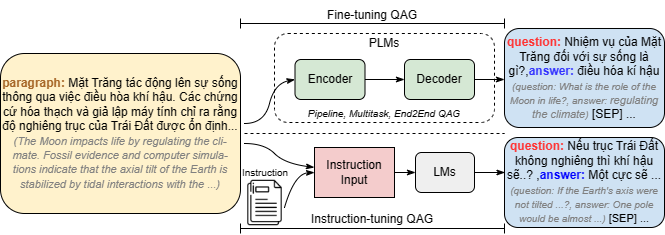

# Towards Vietnamese Question and Answer Generation: An Empirical Study
Question-answer generation is formulated as a text-generation task by using PLMs and LLMs. Given a context paragraph $C = \{s_{1}, s_{2}, ..., s_{n}\}$ with $\textit{n}$ sentences, QAG models are required to generate natural QA pairs $\mathcal{Q}$ = $\{(q_{1}, a_{1}), (q_{2}, a_{2}), ...\}$. Formally, QAG can be written as a conditional generation process as $\mathcal{Q} = f(Q|C, \theta)$, where $Q$ is the gold QA pairs in the training dataset, $C$ is the context, $f()$ is an encoder-decoder or a generative language model, and $\theta$ is the parameter of the model. The parameter $\theta$ can be learned by using encoder-decoder PLMs or generative LLMs.

<figure>
  <p align="center">
    
  </p>
  <p align="center"><strong>Fig.1: The system overview of fine-tuning and instruction fine-tuning QAG.</strong></p>
</figure>

## Usage
### Install
```
git clone https://github.com/Shaun-le/ViQAG.git
cd ViQAG
```
### Prerequisite
To install dependencies, run:
```
pip install -r requirements.txt
```

## Question and Answers Generation
- **Generate QAG with Pipeline Models:** The pipeline model operates in two distinct stages for Question Answer Generation (QAG): answer extraction/generation (AE) and question generation (QG). In the initial phase, the model takes an input paragraph context $C$ and produces a corresponding answer $\bar{a}$ through extraction or generation. Subsequently, leveraging the obtained answer $\bar{a}$ along with the context $C$, the model generates the question $\bar{q}$. Since the Pipeline trains independent AE and QG models, they need to be handled separately. The models are referred to as ```model``` and ```model_ae```, representing QG and AE models, respectively.
```python
from plms.language_model import TransformersQG
model = TransformersQG(model='namngo/pipeline-vit5-viquad-qg', model_ae='namngo/pipeline-vit5-viquad-ae')

input = 'Lê Lợi sinh ra trong một gia đình hào trưởng tại Thanh Hóa, trưởng thành trong thời kỳ Nhà Minh đô hộ nước Việt.' \
        'Thời bấy giờ có nhiều cuộc khởi nghĩa của người Việt nổ ra chống lại quân Minh nhưng đều thất bại.' \
        'Năm 1418, Lê Lợi tổ chức cuộc khởi nghĩa Lam Sơn với lực lượng ban đầu chỉ khoảng vài nghìn người.' \
        'Thời gian đầu ông hoạt động ở vùng thượng du Thanh Hóa, quân Minh đã huy động lực lượng tới hàng vạn quân để đàn áp,' \
        'nhưng bằng chiến thuật trốn tránh hoặc sử dụng chiến thuật phục kích và hòa hoãn, nghĩa quân Lam Sơn đã dần lớn mạnh.'

pred = model.generate_qa(input)

print(pred)

[
  ('Quân Minh đã sử dụng chiến thuật nào để đánh quân vào vùng thượng du Thanh Hóa?','huy động lực lượng tới hàng vạn quân')
  ('Có bao nhiêu cuộc khởi nghĩa của người Việt chống lại quân Minh?', 'nhiều cuộc khởi nghĩa của người Việt nổ ra'),
  ('Lê Lợi đã làm gì vào năm 1418?', 'tổ chức cuộc khởi nghĩa Lam Sơn'),
]
```

- **Generate QAG with Multitask and End2End Models:** The Multiask models are trained to both generate answers and questions, which distinguishes them from End2End models capable of generating question-answer pairs simultaneously. Since both methods utilize a single model, only passing the ```model``` is sufficient.
```python
from plms.language_model import TransformersQG
model = TransformersQG(model='shnl/vit5-vinewsqa-qg-ae')

input = 'Lê Lợi sinh ra trong một gia đình hào trưởng tại Thanh Hóa, trưởng thành trong thời kỳ Nhà Minh đô hộ nước Việt.' \
        'Thời bấy giờ có nhiều cuộc khởi nghĩa của người Việt nổ ra chống lại quân Minh nhưng đều thất bại.' \
        'Năm 1418, Lê Lợi tổ chức cuộc khởi nghĩa Lam Sơn với lực lượng ban đầu chỉ khoảng vài nghìn người.' \
        'Thời gian đầu ông hoạt động ở vùng thượng du Thanh Hóa, quân Minh đã huy động lực lượng tới hàng vạn quân để đàn áp,' \
        'nhưng bằng chiến thuật trốn tránh hoặc sử dụng chiến thuật phục kích và hòa hoãn, nghĩa quân Lam Sơn đã dần lớn mạnh.'

pred = model.generate_qa(input)

print(pred)

[
  ('Lê Lợi sinh ra trong hoàn cảnh nào?', 'một gia đình hào trưởng'),
  ('Lực lượng ban đầu của Lê Lợi là bao nhiêu?', 'khoảng vài nghìn người'),
  ('Quân Minh đã huy động lực lượng tới bao nhiêu quân để đàn áp?', 'hàng vạn quân')
]
```

## Models Development

### Data
Please prepare your data in the `jsonl` format like our provided sample datasets, we'll take care of the rest, just execute the following command:

For Pipeline and Multitask:
```
python qg_data.py process_data --input_dir 'input dir' --output_dir 'output dir'
```
For End2End and Instruction:
```
python qag_data.py process_data --input_dir 'input dir' --output_dir 'output dir' --instruction_path 'instruction path'
```
If you don't want to use our instruction set, you can customize it according to your preferences by modifying the instructions in [here](data/instructions.txt).

### Fine-tuning
Fine-tuning Pipeline Model:
```
coming soon
```
Fine-tuning Multitask Model:
```
python train.py fine-tuning --model 'VietAI/vit5-base' --dataset_path 'shnl/qg-example'
```
<figure>
  <p align="center">
    
  </p>
  <p align="center"><strong>Fig.1: The system overview of fine-tuning and instruction fine-tuning QAG.</strong></p>
</figure>

### Instruction-tuning
```
comming soon
```
<figure>
  <p align="center">
    
  </p>
  <p align="center"><strong>Fig.1: The system overview of fine-tuning and instruction fine-tuning QAG.</strong></p>
</figure>

### 🦙 Alpaca-LoRA LLMs
```
comming soon
```
### Evaluation
```
coming soon
```
## ViQAG
We introduce a demo application system ViQAG at [here](https://viqag.000webhostapp.com). The brief introduction of the system was also shown in a video ↓↓↓

<p align="center">
  <a href="https://www.youtube.com/watch?v=hIlQgg7ygQU" onclick="window.open(this.href); return false;"></a>
</p>

## Citation
```
Comming Soon!
```
